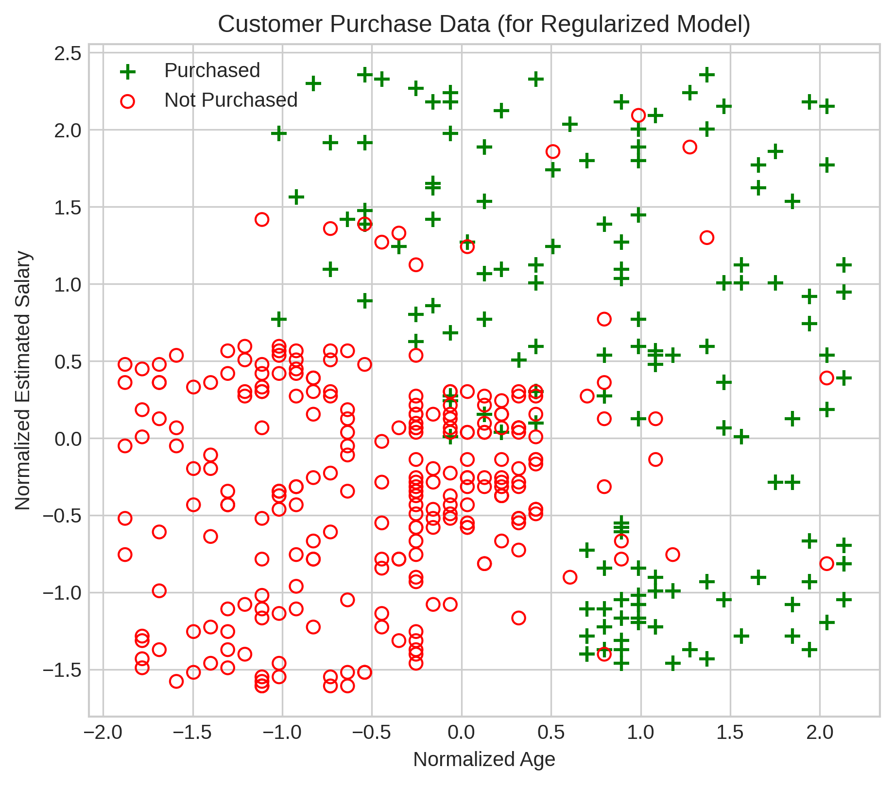
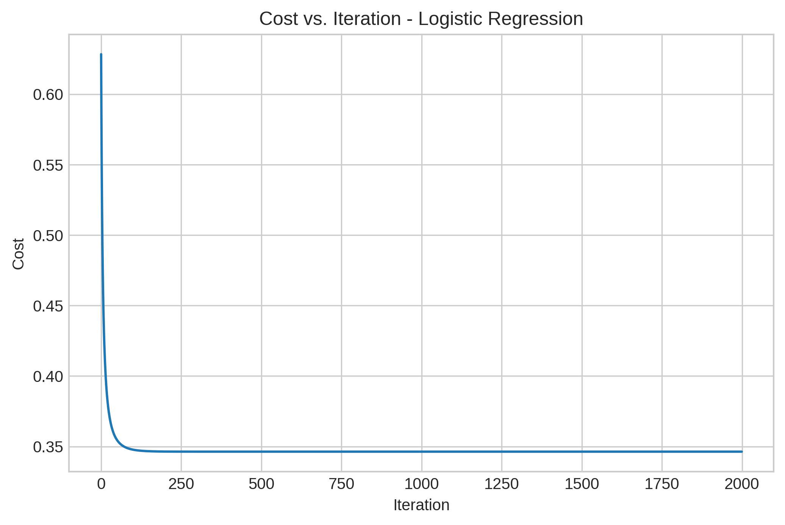
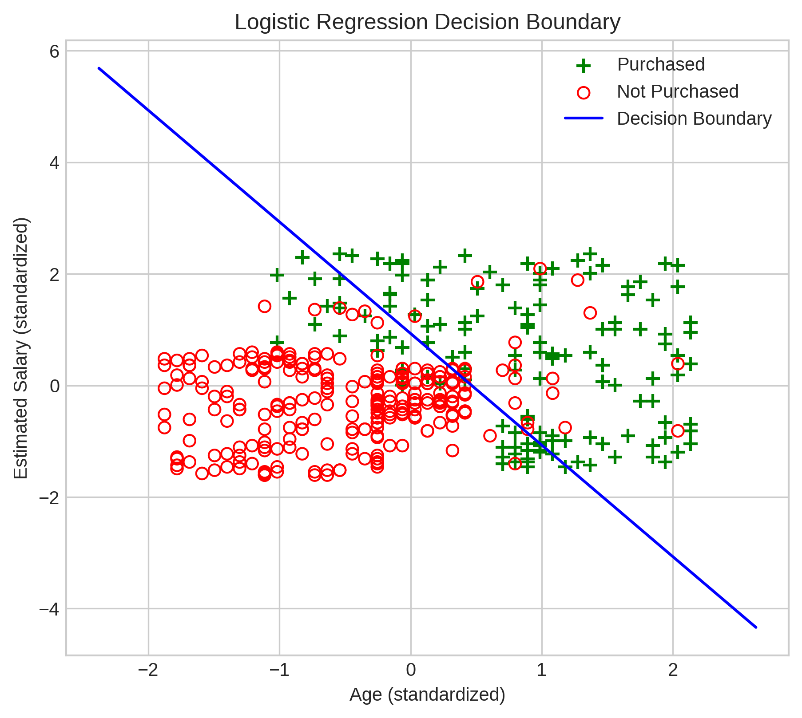
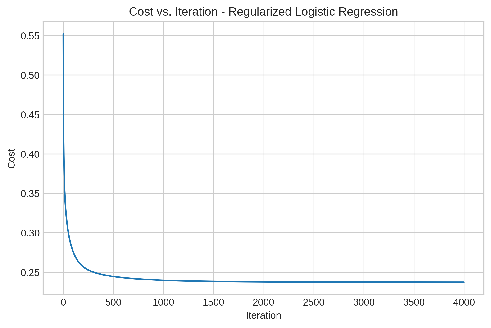
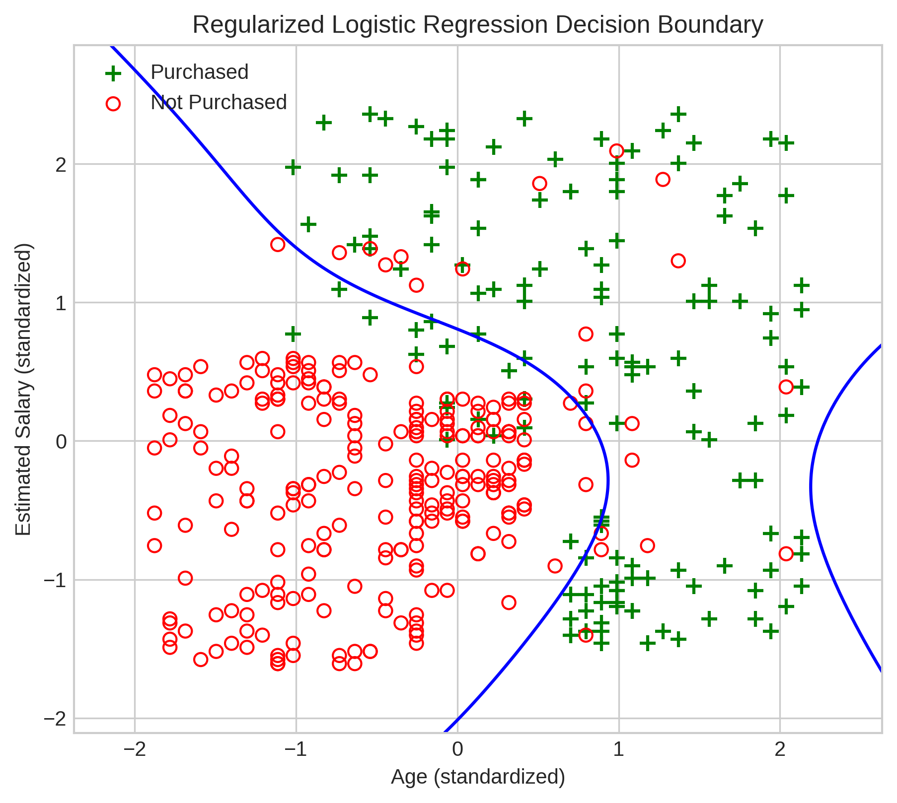
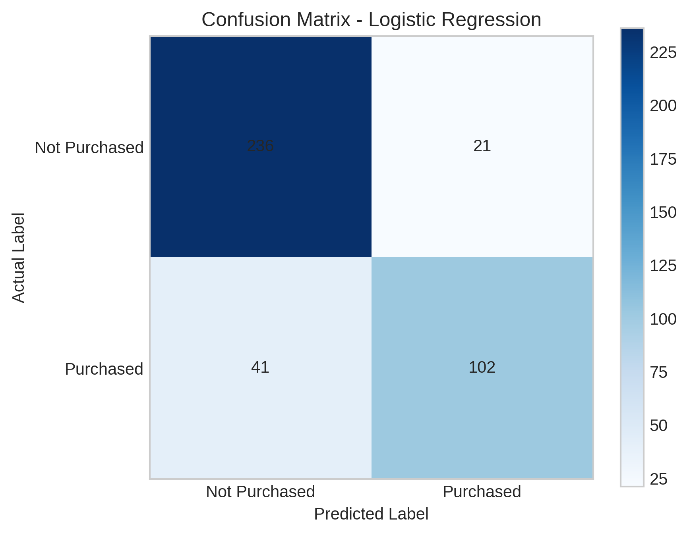
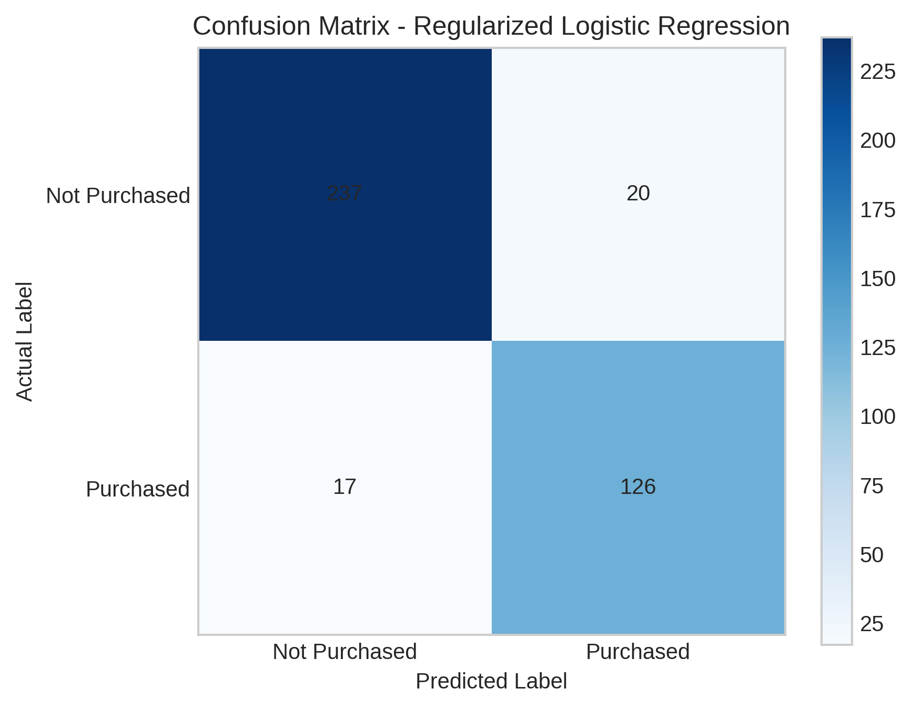

# 🛒 Customer Purchase Prediction

A machine learning project that predicts whether a customer will purchase a product based on **Age** and **Estimated Salary** using Logistic Regression.

This project is a practical implementation of concepts learned from the **DeepLearning.AI – Supervised Machine Learning: Regression and Classification** course on Coursera. The model is implemented **from scratch using NumPy** to strengthen my understanding of the underlying mathematics, including the sigmoid function, cost function, gradient computation, gradient descent, and regularization.

The course concepts were applied to the **Social Network Ads dataset from Kaggle** to build a customer purchase prediction use case.

## 🎯 Business Problem

A marketing team wants to identify customers who are more likely to purchase a product after seeing a social media advertisement.

The model uses:

- Age
- Estimated Salary

to predict:

- `0` — Not Purchased
- `1` — Purchased

## 📊 Dataset

**Social Network Ads Dataset**

This project uses the **Social Network Ads** dataset by Rakesh Rau, available on Kaggle.

The dataset contains customer information used to predict whether a customer purchases a product after viewing an advertisement.

**Features used:**
- `Age` — Customer's age
- `EstimatedSalary` — Customer's estimated salary
- `Purchased` — Target variable (0 = Not Purchased, 1 = Purchased)

**Dataset size:** 400 observations

**Source:** Kaggle (`rakeshrau/social-network-ads`)

### Customer Purchase Data

  

## 🧠 Modeling Approach

### Logistic Regression from Scratch

The first model implements:

1. Feature scaling
2. Sigmoid function
3. Logistic cost function
4. Gradient computation
5. Gradient descent
6. Prediction
7. Decision boundary
8. Model evaluation

**Training Accuracy: 84.50%**

### Cost Convergence

  

### Linear Decision Boundary

  

The baseline Logistic Regression model uses a **linear decision boundary** to separate Purchased and Not Purchased customers.

---

### Regularized Logistic Regression

The second model extends the baseline model using:

- Polynomial feature mapping (degree = 6)
- Feature scaling after mapping
- L2 regularization
- Non-linear decision boundary

The original 2 features are transformed into **27 polynomial features**.

**Training Accuracy: 90.75%**

### Cost Convergence

  

### Non-linear Decision Boundary

  

Polynomial feature mapping allows the model to capture more complex, non-linear relationships between Age, Estimated Salary, and purchase behavior.

---

## 📈 Model Performance

| Metric | Logistic Regression | Regularized Logistic Regression |
|---|---:|---:|
| Accuracy | 84.50% | 90.75% |
| Purchased Precision | 0.83 | 0.86 |
| Purchased Recall | 0.71 | 0.88 |
| Purchased F1-score | 0.77 | 0.87 |

### Logistic Regression Confusion Matrix

  

### Regularized Logistic Regression Confusion Matrix

  

The regularized model significantly improved **Purchased recall from 71% to 88%**, meaning the model was able to identify more customers who actually purchased the product.

## 🔍 Key Insights

The original customer classes are not perfectly linearly separable using Age and Estimated Salary.

Polynomial feature mapping allows Logistic Regression to learn a more flexible non-linear decision boundary.

However, increasing model complexity also increases the risk of overfitting. L2 regularization is therefore used to control the magnitude of model weights.

## 🛠️ Tech Stack

- Python
- NumPy
- Pandas
- Matplotlib
- Scikit-learn
- KaggleHub
- Google Colab

## 📁 Notebook

See `Customer_Purchase_Prediction.ipynb` for the complete implementation and step-by-step explanation.
